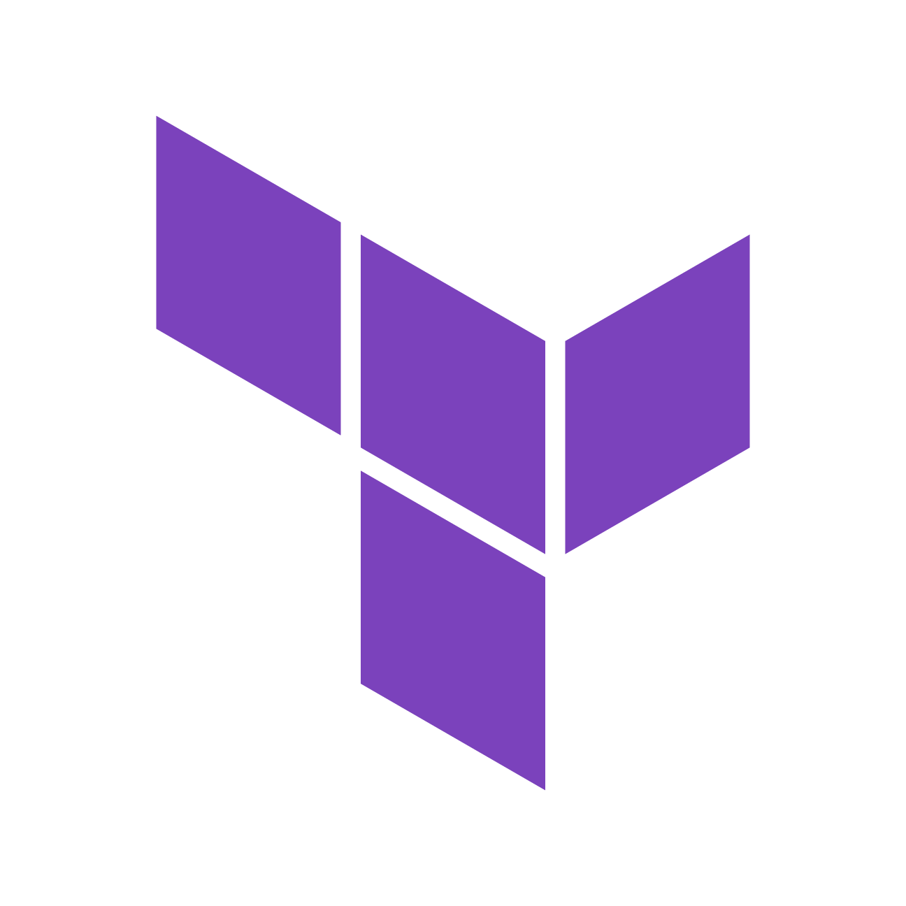

<a href="https://cloud.hashicorp.com/products/terraform">
    
</a>

# Kubernetes Cluster API Provider for Terraform Cloud

> **Warning**
> Please note that this is a technical preview and is for experimental purposes only. Please [open issues](https://github.com/hashicorp/cluster-api-provider-terraform-cloud/issues) generously if you have feedback.

Kubernetes-native declarative infrastructure using Terraform Cloud.

## What is the Cluster API Provider for Terraform Cloud?

The [Cluster API](https://github.com/kubernetes-sigs/cluster-apiterra) project brings declarative Kubernetes-style APIs to cluster creation, configuration and management. This provider allows you to create [Terraform Modules](https://developer.hashicorp.com/terraform/language/modules) to implement Cluster API's contracts and run them in [Terraform Cloud](https://cloud.hashicorp.com/products/terraform) to provision the infrastructure using Kubernetes as your source of truth.  

## Supported Cluster API contracts

The provider currently implements the contracts that allow the infrastructure for [managed clusters and machine pools](./docs/managedclusters.md) to be provisioned. 

- [Cluster](https://cluster-api.sigs.k8s.io/developer/architecture/controllers/cluster.html) and [Control Plane](https://cluster-api.sigs.k8s.io/developer/architecture/controllers/control-plane.html) are fulfilled by [TFCManagedControlPlane](./docs/managedclusters.md#TFCManagedControlPlane)  
- [MachinePool](https://cluster-api.sigs.k8s.io/developer/architecture/controllers/machine-pool.html) is fulfilled by [TFCManagedMachinePool](./docs/managedclusters.md#TFCManagedMachinePool)


## Getting Started

You’ll need a Kubernetes cluster to run against. You can use [kind](https://sigs.k8s.io/kind) or [minikube](https://minikube.sigs.k8s.io/docs/start/) to get a local cluster up and running.


### Running on the cluster

1. Install CRDs into the cluster

```sh
make install
```

2. Build and push your image to the location specified by `IMG`:
	
```sh
make docker-build docker-push IMG=<some-registry>/cluster-api-provider-terraform-cloud:tag
```
	
3. Deploy the controller to the cluster with the image specified by `IMG`:

```sh
make deploy IMG=<some-registry>/cluster-api-provider-terraform-cloud:tag
```

## Running locally 

> **NOTE: When run locally controller will automatically use the current context in your kubeconfig file (i.e. whatever cluster `kubectl cluster-info` shows).**

For development purposes you can run the controller locally by running:

```sh
make run 
```

### Uninstall CRDs

To delete the CRDs from the cluster:

```sh
make uninstall
```

### Undeploy controller

Remove the controller to the cluster:

```sh
make undeploy
```

### How it works

This project follows the Kubernetes [Operator pattern](https://kubernetes.io/docs/concepts/extend-kubernetes/operator/)

It uses [Controllers](https://kubernetes.io/docs/concepts/architecture/controller/) 
which provides a reconcile function responsible for synchronizing resources until a desired state is reached.

In the case of this provider, the controllers will trigger runs inside [Terraform Cloud](https://cloud.hashicorp.com/products/terraform) using [Terraform Modules](https://developer.hashicorp.com/terraform/language/modules) configured in the API resource. The controller will monitor the Terraform Cloud run until is it finished and collect the outputs, using them to fulfill the [Cluster API contract](https://cluster-api.sigs.k8s.io/developer/providers/contracts.html) of that particular resource. 


### Modifying the API definitions

If you are editing the API definitions, generate the manifests such as CRs or CRDs using:

```sh
make manifests
```

**NOTE:** Run `make --help` for more information on all potential `make` targets

More information can be found via the [Kubebuilder Documentation](https://book.kubebuilder.io/introduction.html) and [Cluster API Documentation](https://cluster-api.sigs.k8s.io/developer/providers/implementers-guide/overview.html)

## Contributing 

This project is highly experimental and we welcome contributions in the form of opening issues and pull requests. You can also come and talk to us in `#terraform-providers` on the [Kubernetes Slack](http://slack.kubernetes.io). 

Contributors should refer to our [Code of Conduct](.github/CODE_OF_CONDUCT.md)


## Security Reporting

If you think you've found a security vulnerability, we'd love to hear from you.

Follow the instructions in [SECURITY.md](.github/SECURITY.md) to make a report.
